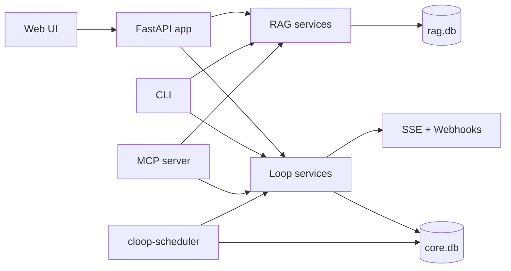

# Cloop (Closed Loop)

[](https://github.com/fitchmultz/cloop/actions/workflows/ci.yml)
[](https://github.com/fitchmultz/cloop/actions/workflows/ci_full.yml)
[](LICENSE)
[](pyproject.toml)

Cloop is a local-first loop/task and knowledge assistant with a web UI, CLI, HTTP API, and MCP server.
It lets you capture work, manage loop state, ingest local documents for RAG, and expose a narrow tool surface to agents without standing up external infrastructure.

No Docker. No external vector database. Loop and retrieval data stay in local SQLite files (`core.db`, `rag.db`) by default.

## Architecture at a glance



- Public architecture summary: [`docs/architecture.md`](docs/architecture.md)
- AI runtime + pi bridge boundary: [`docs/ai_runtime.md`](docs/ai_runtime.md)
- Product roadmap: [`docs/roadmap.md`](docs/roadmap.md)
- Verification checklist: [`docs/verification_checklist.md`](docs/verification_checklist.md)

## Why “Closed Loop”?

Cloop stands for **Closed Loop**.

A **loop** is anything that’s “open” in your mind:

- a task you need to do (big or small)
- a decision you haven’t made yet
- a thread you don’t want to forget (“follow up with…”, “figure out…”, “buy…”, “read…”)

Keeping lots of loops in your head consumes working memory. That mental background load makes it harder to focus, easier to forget things, and more exhausting to start or finish work.

The long-term goal of Cloop is simple: **get loops out of your head and into a trusted local system** that you control — so you can close them deliberately instead of carrying them around.

Today, Cloop is the foundation for that: a private local knowledge base + lightweight persistent memory you can query. The “closed loop” experience is: capture → retrieve → act → confirm → close.

## Design and Architecture

- Start with the concise architecture walkthrough: [docs/architecture.md](docs/architecture.md)
- Use [docs/ai_runtime.md](docs/ai_runtime.md) for the pi bridge protocol, startup assumptions, and failure semantics.
- Use [docs/roadmap.md](docs/roadmap.md) as the canonical plan for AI capability and interface-parity work.
- Use [docs/verification_checklist.md](docs/verification_checklist.md) for setup, validation, and smoke-test commands.

## Features

- **Pi-powered chat**: Route all generative chat/tool calls through a local pi bridge while keeping Python in control of app state and tools.
- **Private RAG**: Recursively ingest files → chunk → embed → store in SQLite → retrieve relevant context.
- **No heavy infrastructure**: Pure Python + SQLite; optional SQLite vector extensions if you have them.
- **CLI + API**: Use it from the terminal, the built-in web UI, or a local HTTP server.
- **Persistent memory**: Direct memory CRUD/search across HTTP, web, CLI, and MCP, all backed by the shared `memory_management` contract in `core.db`.
- **Semantic loop search**: Query loops by meaning across HTTP, the web Inbox, CLI, and MCP using the shared `read_service` + `loops/similarity.py` contract with on-demand embedding backfill.
- **Relationship review**: Review semantically similar loops as duplicate vs related work across HTTP, the web Review tab, CLI, and MCP via the shared `loops/relationship_review.py` contract.
- **Saved review workflows**: Persist reusable review actions plus filtered relationship/enrichment review sessions across HTTP, the web Review tab, CLI, and MCP via the shared `loops/review_workflows.py` contract.
- **Checkpointed planning workflows**: Generate durable AI-native planning sessions with explicit checkpoints, deterministic loop operations, execution history, and refreshable grounded context across HTTP, the web Review tab, CLI, and MCP via the shared `loops/planning_workflows.py` contract.
- **Bulk enrichment workflows**: Preview and re-run explicit enrichment across filtered loop sets from HTTP, the web Review tab, the Inbox bulk action bar, CLI, and MCP via the shared `loops/enrichment_orchestration.py` contract.
- **Streaming (SSE)**: Stream `/chat` and `/ask` responses when enabled.
- **Loop capture + inbox**: Guaranteed capture with a simple loop state machine (inbox → actionable/blocked/scheduled → completed).
- **Autopilot suggestions**: Gemini-powered enrichment stored as suggestions with confidence + provenance.
- **Next 5**: Deterministic prioritization for actionable loops.
- **MCP tools**: A purpose-built MCP server that exposes loop operations, direct memory CRUD/search, grounded chat, and RAG ingest/ask retrieval tools.

Supported file types for ingestion: `.txt`, `.md`, `.markdown`, `.pdf`.

## What you can use it for (now)

- **Personal knowledge base**: Drop in docs, notes, PDFs; ask questions later with cited sources.
- **Project recall**: Keep design notes, meeting notes, and decision history in a searchable store.
- **Loop capture (lightweight)**: Use notes as a “working memory dump” so you stop rehearsing open loops.

## The “loops” model (how to think about it)

If you want a simple mental model, treat each loop as having:

- **Trigger**: What caused it to appear? (“Email from…”, “Bug report…”, “Random idea…”)
- **Intent**: What does “completed” mean? (clear definition of closed)
- **Next action**: The smallest step you can do next
- **Context**: Links, filenames, snippets, and references that make it easy to resume later
- **Review cadence**: When should you look at it again? (today, next week, someday)

Cloop’s role is to keep the **context** and make retrieval effortless, so “next action” is the only thing you have to hold in your head.

## Installation

### Prerequisites

- Python 3.14+
- Node 20+
- `uv` (recommended): https://docs.astral.sh/uv/
- `pi` installed and authenticated for the models you plan to use

### Setup

```bash
uv sync --all-groups --all-extras
npm ci --prefix src/cloop/pi_bridge
cp .env.example .env
```

Then edit `.env` to point at your pi and embedding configuration (see Configuration).

### Minimal local-only configuration (recommended first run)

If you want the shortest path to a running local instance, start with:

```dotenv
CLOOP_PI_MODEL=zai/glm-5
CLOOP_PI_ORGANIZER_MODEL=zai/glm-5
CLOOP_EMBED_MODEL=ollama/nomic-embed-text
CLOOP_OLLAMA_API_BASE=http://localhost:11434
CLOOP_AUTOPILOT_ENABLED=false
CLOOP_SCHEDULER_ENABLED=false
```

This keeps the generative path on pi while embeddings stay local on Ollama.
If you prefer a different pi selector, common project-preferred alternatives are
`kimi-coding/k2p5` and `openai-codex/gpt-5.4`, but any selector that `pi --list-models`
shows as available is valid.

When you do enable scheduling, run it as a separate process:

```bash
cloop-scheduler
```

## Security and privacy

- Keep Cloop local by default (`localhost` / trusted private network only).
- Do not expose the service directly to the public internet without adding your own auth and perimeter controls.
- Never commit `.env` or other credential files. Use `.env.example` as your template.
- If a secret is ever exposed, revoke/rotate it immediately.
- See [SECURITY.md](SECURITY.md) for reporting and handling guidance.

## Quick Start (CLI)

Ingest a folder of documents:

```bash
uv run cloop ingest ./my-docs
```

Retrieve the most relevant chunks for a question:

```bash
uv run cloop ask "What does the onboarding process say about PTO?" --k 5
```

Run grounded chat from the terminal using the shared `/chat` contract:

```bash
uv run cloop chat "What should I focus on today?" --include-loop-context --include-memory-context
uv run cloop chat "Where is the onboarding checklist?" --include-rag-context --rag-scope onboarding
```

Capture a loop and manage your tasks:

```bash
uv run cloop capture "Return Amazon package by Friday" --tz-offset-min -420
uv run cloop loop list --status inbox
uv run cloop loop semantic-search "errands I can batch with the post office"
uv run cloop loop update 1 --next-action "Go to post office" --due-at "2026-02-15T18:00:00Z"
uv run cloop loop close 1 --note "Done"
uv run cloop next
```

Manage durable memory directly:

```bash
uv run cloop memory create "User prefers dark mode" --category preference --priority 40
uv run cloop memory search "dark mode"
uv run cloop memory list --category preference
```

Notes:

- `cloop ask` prints JSON including the generated `answer`, retrieved `chunks`, and `sources`.
- `cloop chat` reuses the shared grounded chat contract from the HTTP `/chat` endpoint and supports `text` or `json` output.
- The HTTP `/ask` endpoint returns the same answer-oriented payload, with optional SSE streaming.
- Loop lifecycle and utility commands support `--format json|table` (default: `json`).

## Validation shortcut

If you want a quick end-to-end repo validation path, use:
- [docs/verification_checklist.md](docs/verification_checklist.md)

## CLI Reference

### Chat Commands

```bash
# One-shot chat
cloop chat <prompt> [--format text|json]

# Add loop + memory grounding
cloop chat <prompt> --include-loop-context --include-memory-context

# Add document grounding
cloop chat <prompt> --include-rag-context [--rag-k N] [--rag-scope SCOPE]

# Stream token output
cloop chat <prompt> --stream

# Continue from a transcript file
cloop chat [<prompt>] --messages-file transcript.json

# Read the prompt from stdin explicitly
printf 'What should I do next?\n' | cloop chat -

# Manual tool call
cloop chat <prompt> --tool TOOL_NAME [--tool-arg KEY=VALUE ...]
```

Notes:
- `cloop chat` uses the same request/response model as the HTTP `/chat` endpoint.
- `--format text` is the default for conversational use; `--format json` emits the full structured response payload.
- `--tool` implies manual tool mode; otherwise CLI chat defaults to `tool_mode=none` unless you pass `--tool-mode` explicitly.

### Memory Commands

```bash
# List memory entries
cloop memory list [--category CATEGORY] [--source SOURCE] [--min-priority N] [--cursor CURSOR] [--format json|table]

# Search memory entries by key/content text
cloop memory search <query> [--category CATEGORY] [--source SOURCE] [--min-priority N] [--cursor CURSOR] [--format json|table]

# Fetch one memory entry
cloop memory get <id> [--format json|table]

# Create a memory entry
cloop memory create <content> [--key KEY] [--category CATEGORY] [--priority N] [--source SOURCE] [--metadata-json JSON] [--format json|table]

# Update a memory entry
cloop memory update <id> [--key KEY | --clear-key] [--content TEXT] [--category CATEGORY] [--priority N] [--source SOURCE] [--metadata-json JSON] [--format json|table]

# Delete a memory entry
cloop memory delete <id> [--format json|table]
```

Notes:
- `cloop memory *` reuses the shared `src/cloop/memory_management.py` contract rather than talking to storage directly.
- Updates preserve field presence, so `--clear-key` explicitly clears the nullable key instead of silently ignoring it.
- `--metadata-json` must be a JSON object.

### Loop Lifecycle Commands

Full loop lifecycle management from the terminal:

```bash
# Get a loop by ID
cloop loop get <id> [--format json|table]

# List loops with filters
cloop loop list [--status STATUS] [--tag TAG] [--limit N] [--offset N] [--format json|table]
# Status options: inbox, actionable, blocked, scheduled, completed, dropped, open (default), all

# Search loops by DSL/text filters
cloop loop search <query> [--limit N] [--offset N] [--format json|table]

# Search loops by semantic similarity
cloop loop semantic-search <query> [--status STATUS] [--limit N] [--offset N] [--min-score FLOAT] [--format json|table]

# Update loop fields
cloop loop update <id> [OPTIONS] [--format json|table]
  --title TEXT              Update title
  --summary TEXT            Update summary
  --next-action TEXT        Update next action
  --due-at ISO8601          Update due date
  --snooze-until ISO8601    Update snooze time
  --time-minutes N          Estimated time
  --activation-energy N     0-3 scale
  --urgency FLOAT           0.0-1.0
  --importance FLOAT        0.0-1.0
  --project TEXT            Project name
  --blocked-reason TEXT     Reason for blocked status
  --tags TAGS               Comma-separated tags (clears existing)

# Transition loop status
cloop loop status <id> <status> [--note TEXT] [--format json|table]
# Status options: inbox, actionable, blocked, scheduled, completed, dropped

# Close a loop (completed or dropped)
cloop loop close <id> [--dropped] [--note TEXT] [--format json|table]

# Run AI enrichment synchronously and return the updated loop + suggestion metadata
cloop loop enrich <id> [--format json|table]

# Preview or run bulk enrichment across a filtered loop set
cloop loop bulk enrich --query "status:open" [--dry-run] [--limit 25] [--yes] [--format json|table]

# Snooze a loop
cloop loop snooze <id> <duration> [--format json|table]
# Duration examples: 30m, 1h, 2d, 1w, or ISO8601 timestamp

# Review duplicate/related candidates for one loop
cloop loop relationship review --loop <id> [--status open|all|inbox|actionable|blocked|scheduled|completed|dropped]

# List loops with pending relationship-review work
cloop loop relationship queue [--kind all|duplicate|related] [--status open|all|...]

# Confirm or dismiss a relationship decision
cloop loop relationship confirm --loop <id> --candidate <id> --type related|duplicate
cloop loop relationship dismiss --loop <id> --candidate <id> --type related|duplicate

# Save reusable relationship-review actions and filtered sessions
cloop review relationship-action create --name dismiss-suggested --action dismiss --relationship-type suggested
cloop review relationship-session create --name duplicate-pass --query "status:open" --kind duplicate
cloop review relationship-session apply-action --session 1 --loop 10 --candidate 11 --candidate-type duplicate --action-id 2
```

Notes:
- `cloop loop semantic-search` returns ranked loop payloads plus `semantic_score` and indexing metadata in JSON mode.
- Semantic search backfills missing or stale loop embeddings on demand, so older loops become searchable without a one-off migration step.
- `cloop loop relationship *` reuses the shared semantic similarity + relationship review contract, so duplicate/related classification and review-state persistence stay aligned with HTTP, web, and MCP.
- `cloop loop bulk enrich` reuses the shared enrichment orchestration contract, so filtered target selection, result envelopes, and follow-up suggestion/clarification behavior stay aligned with HTTP, web, and MCP.

### Utility Commands

```bash
# List all tags in use
cloop tags [--format json|table]

# List all projects
cloop projects [--format json|table]

# Review enrichment suggestions
cloop suggestion list [--loop-id ID] [--pending] [--format json|table]
cloop suggestion show <suggestion-id> [--format json|table]
cloop suggestion apply <suggestion-id> [--fields title,tags] [--format json|table]
cloop suggestion reject <suggestion-id> [--format json|table]

# Review and answer clarification questions
cloop clarification list --loop-id <loop-id> [--format json|table]
cloop clarification answer <clarification-id> --loop-id <loop-id> --answer "Friday"
cloop clarification answer-many --loop-id <loop-id> --item 12=Friday --item 13=Finance
cloop clarification refine --loop-id <loop-id> --item 12=Friday --item 13=Finance

# Save reusable enrichment-review actions and filtered sessions
cloop review enrichment-action create --name apply-title --action apply --fields title
cloop review enrichment-session create --name follow-up-pass --query "status:open" --pending-kind all
cloop review enrichment-session move --session 1 --direction next
cloop review enrichment-session apply-action --session 1 --suggestion 15 --action-id 3
cloop review enrichment-session answer-clarifications --session 1 --loop 10 --item 21=Friday

# Guided relationship-review sessions
cloop review relationship-session create --name duplicate-pass --query "status:open" --kind duplicate
cloop review relationship-session move --session 2 --direction next

# Checkpointed planning sessions
cloop plan session create --name weekly-reset --prompt "Build a checkpointed plan for my open launch work" --query "status:open"
cloop plan session execute --session 3
cloop plan session refresh --session 3

# Export loops
cloop export [--output FILE] [--format json|table]
# Writes to stdout if no --output specified

# Import loops
cloop import [--file FILE] [--format json|table]
# Reads from stdin if no --file specified
```

### Review Commands

```bash
# View review cohorts (daily by default)
cloop loop review [--format json|table]

# Weekly review only (stale + blocked_too_long)
cloop loop review --weekly --no-daily

# Both daily and weekly
cloop loop review --all

# Limit items per cohort
cloop loop review --limit 5

# Filter to specific cohort
cloop loop review --cohort stale
```

Review cohorts identify loops needing attention:
- **daily**: stale (72h+), no_next_action, blocked_too_long (48h+), due_soon_unplanned (48h)
- **weekly**: stale, blocked_too_long (deeper review subset)

### RAG Commands

```bash
# Ingest documents
cloop ingest <paths...> [--mode MODE] [--no-recursive]
# Mode options: add (default), reindex, purge, sync

# Query knowledge base
cloop ask <question> [--k N] [--scope SCOPE]
```

### Capture Commands

```bash
# Capture a loop
cloop capture <text> [STATUS_FLAGS] [--captured-at ISO8601] [--tz-offset-min N]
# Status flags: --actionable, --scheduled, --blocked
# Aliases: --urgent (same as --actionable), --waiting (same as --blocked)

# View inbox
cloop inbox [--limit N]

# View next actions (prioritized)
cloop next [--limit N]
# `--limit` is a total cap across all buckets, not per bucket
```

### Exit Codes

- `0`: Success
- `1`: Validation error (invalid arguments, no fields to update, etc.)
- `2`: Not found error (loop not found, invalid transition, etc.)

### Example Workflows

**Capture and complete a task:**
```bash
uv run cloop capture "Review PR #123" --actionable
uv run cloop loop update 1 --next-action "Open PR" --due-at "2026-02-14T17:00:00Z"
uv run cloop loop list --status actionable
uv run cloop loop close 1 --note "Approved and merged"
```

**Export and import data:**
```bash
uv run cloop export --output backup.json
uv run cloop import --file backup.json
```

**Search and update:**
```bash
uv run cloop loop search "groceries"
uv run cloop loop semantic-search "buy milk and eggs"
uv run cloop loop update 5 --tags "shopping,weekly"
```

## Running the Server

Start the local service:

```bash
uv run uvicorn cloop.main:app --reload
```

Then open `http://127.0.0.1:8000/` for the Quick Capture UI.

Endpoints:

- `GET /docs`: interactive Swagger UI for all API operations.
- `GET /redoc`: ReDoc-style API reference.
- `GET /openapi.json`: machine-readable OpenAPI schema.
- `POST /chat`: chat completion with configurable tool/grounding options; `?stream=true` for SSE streaming.
- `POST /ingest`: ingest local files/folders into `rag.db`.
- `GET /ask`: RAG question answering; returns an answer plus `sources` pointing at the retrieved chunks.
- `GET /health`: shows the active pi backend, chat/organizer models, embedding model, and bridge readiness.
- `POST /loops/capture`: capture a loop (write-first).
- `GET /loops`: list loops (default `status=open`).
- `GET /loops/{id}`: fetch a loop.
- `POST /loops/search/semantic`: semantic loop search with ranked matches plus on-demand embedding refresh metadata.
- `GET /loops/relationships/review`: relationship-review queue across loops with duplicate/related candidate previews.
- `GET /loops/{id}/relationships/review`: per-loop duplicate/related candidate review.
- `POST /loops/{id}/relationships/{candidate_id}/confirm`: confirm a duplicate or related relationship decision.
- `POST /loops/{id}/relationships/{candidate_id}/dismiss`: dismiss a duplicate or related relationship suggestion.
- `PATCH /loops/{id}`: update loop fields.
- `POST /loops/{id}/close`: close a loop (completed or dropped).
- `POST /loops/{id}/enrich`: run synchronous enrichment for a loop and return the updated loop plus suggestion metadata.
- `POST /loops/bulk/enrich`: run explicit enrichment for a selected set of loops.
- `POST /loops/bulk/query/enrich`: preview or run explicit enrichment across a DSL-selected loop set.
- `GET /loops/planning/sessions`: list saved planning sessions.
- `POST /loops/planning/sessions`: create a planning session from a grounded AI prompt.
- `GET /loops/planning/sessions/{session_id}`: fetch one planning session snapshot.
- `POST /loops/planning/sessions/{session_id}/move`: move the current planning checkpoint cursor.
- `POST /loops/planning/sessions/{session_id}/refresh`: regenerate a saved plan against current grounded context.
- `POST /loops/planning/sessions/{session_id}/execute`: execute the current deterministic checkpoint.
- `DELETE /loops/planning/sessions/{session_id}`: delete a saved planning session.
- `GET /loops/{id}/suggestions`: list suggestions for a loop, including linked clarification rows.
- `GET /loops/suggestions/pending`: list unresolved suggestions across loops.
- `GET /loops/suggestions/{suggestion_id}`: fetch one suggestion with parsed payload and linked clarifications.
- `POST /loops/suggestions/{suggestion_id}/apply`: apply suggestion fields to the target loop.
- `POST /loops/suggestions/{suggestion_id}/reject`: reject a suggestion.
- `GET /loops/{id}/clarifications`: list clarification rows for a loop.
- `POST /loops/{id}/clarifications/answer`: answer one or more clarification rows by `clarification_id`.
- `POST /loops/{id}/clarifications/refine`: answer clarification rows and rerun enrichment in one mutation.
- `POST /loops/clarifications/{clarification_id}/answer`: answer a single clarification row.
- `GET /loops/next`: deterministic “Next 5” buckets.
- `GET /loops/tags`: list all tags in use.
- `GET /loops/events/stream`: SSE stream of loop events (capture, update, status changes, enrichment).
- `POST /loops/webhooks/subscriptions`: create webhook subscription for outbound events.
- `GET /loops/webhooks/subscriptions`: list webhook subscriptions.
- `PATCH /loops/webhooks/subscriptions/{id}`: update a webhook subscription.
- `DELETE /loops/webhooks/subscriptions/{id}`: delete a webhook subscription.
- `GET /loops/webhooks/subscriptions/{id}/deliveries`: list delivery history for a subscription.

Example requests:

```bash
curl -X POST http://127.0.0.1:8000/ingest \
  -H 'content-type: application/json' \
  -d '{"paths":["./my-docs"],"mode":"add","recursive":true}'

curl 'http://127.0.0.1:8000/ask?q=What%20is%20Cloop%3F&k=5'
```

## Web UI Workflow

Open `http://127.0.0.1:8000/` after starting the server for a keyboard-driven loop management interface.

### Tabs

| Tab | Purpose |
|-----|---------|
| **Inbox** (1) | Quick capture plus DSL or semantic loop search/filtering |
| **Next** (2) | Prioritized "what should I do now?" buckets |
| **Chat** (3) | LLM conversation with configurable loop, memory, document, and tool grounding |
| **Memory** (4) | Durable memory CRUD/search powered by the shared direct-memory contract |
| **RAG** (5) | Query your knowledge base |
| **Review** (6) | Checkpointed planning sessions, bulk enrichment, saved relationship/enrichment review sessions, plus daily/weekly review cohorts |
| **Metrics** (7) | Loop health statistics |

### Quick Capture

The Inbox tab provides instant capture and search:
1. Type your loop text in the textarea
2. Optionally set status flags: Actionable, Scheduled, Blocked
3. Press Enter or click Save
4. Use the Inbox `mode` control to switch the query bar between DSL filtering and semantic search

Captures are persisted immediately with offline sync support. Semantic Inbox search uses the same shared backend contract as the HTTP, CLI, and MCP surfaces, and older loops are indexed on demand when needed.

### Review Cohorts

The Review tab now has five review layers:

- **Checkpointed planning sessions**: grounded AI plans with durable checkpoints, explicit deterministic operations, execution history, and refreshable context snapshots.
- **Bulk enrichment**: a DSL-driven preview-and-run workflow for re-enriching a filtered loop set without leaving the review workspace.
- **Saved relationship-review sessions**: filtered duplicate/related review queues with preserved cursor state, guided next/previous stepping, saved decision presets, inline confirm/dismiss flows, and duplicate merge entrypoints.
- **Saved enrichment-review sessions**: filtered suggestion/clarification queues with preserved cursor state, guided next/previous stepping, saved apply/reject presets, and one-shot clarification-answer-plus-rerun refinement inside the same session.
- **Daily/weekly cohorts**: deterministic hygiene buckets for stale, blocked, and under-specified loops.

The cohort section groups loops needing attention:

**Daily cohorts**:
- **stale**: Loops not updated in 72+ hours
- **no_next_action**: Actionable loops without a defined next step
- **blocked_too_long**: Blocked for 48+ hours
- **due_soon_unplanned**: Due within 48 hours but no next action

**Weekly cohorts**: Subset of daily (stale, blocked_too_long) for deeper review.

### Keyboard Shortcuts

Press `?` in the web UI to see all shortcuts:

| Action | Keys |
|--------|------|
| New loop (focus capture) | `n` |
| Search/query | `/` |
| Complete selected | `c` |
| Enrich selected | `e` |
| Refresh | `r` |
| Toggle timer | `t` |
| Snooze | `s` |
| Switch tabs | `1`-`7` |
| Go to Inbox/Next/Chat/Memory/RAG/Review/Metrics | `g i` / `g n` / `g c` / `g e` / `g r` / `g v` / `g m` |
| Select all visible | `Ctrl+A` |
| Clear selection | `Esc` |
| Show help | `?` |

### Bulk Operations

Select multiple loops (Shift+Click for range, Ctrl+A for all) to:
- Complete / Drop
- Change status
- Snooze
- Add tags

## Configuration

Cloop reads configuration from environment variables (a `.env` file works well).

### Pi models

- `CLOOP_PI_MODEL`: primary chat model selector in `provider/model` form (default: `zai/glm-5`)
- `CLOOP_PI_ORGANIZER_MODEL`: organizer/enrichment model selector (default: `zai/glm-5`)
- `CLOOP_PI_THINKING_LEVEL`: chat thinking level (`none`, `minimal`, `low`, `medium`, `high`, `xhigh`)
- `CLOOP_PI_ORGANIZER_THINKING_LEVEL`: organizer thinking level
- `CLOOP_PI_TIMEOUT`: chat timeout in seconds (default: `30.0`)
- `CLOOP_PI_ORGANIZER_TIMEOUT`: organizer timeout in seconds (default: `20.0`)
- `CLOOP_PI_BRIDGE_CMD`: optional override for the Node bridge command
- `CLOOP_PI_AGENT_DIR`: optional override for pi auth/model config (`PI_CODING_AGENT_DIR` is also honored)
- `CLOOP_PI_MAX_TOOL_ROUNDS`: max bridge-mediated tool rounds per request (default: `1`)

Cloop does not implement provider-specific auth or billing logic for chat/organizer calls;
it passes these selector strings straight through to pi. The current project-preferred
explicit selectors are `zai/glm-5`, `kimi-coding/k2p5`, and `openai-codex/gpt-5.4`,
but you can use any provider/model combination that pi supports.

Check available models with:

```bash
pi --list-models
```

Authenticate pi separately from Cloop, for example with the normal `pi` login flow for the providers you use.
If the bridge reports model unavailability, startup failures, or protocol problems, use [docs/ai_runtime.md](docs/ai_runtime.md) as the troubleshooting reference.

### Embedding providers

Embeddings remain on LiteLLM-compatible providers during this cutover.

- `CLOOP_EMBED_MODEL`: embedding model used for RAG (default: `ollama/nomic-embed-text`)
- `CLOOP_OLLAMA_API_BASE`: required when embeddings use `ollama/...`
- `CLOOP_LMSTUDIO_API_BASE`: optional when embeddings use `lmstudio/...`
- `CLOOP_OPENAI_API_KEY`: required when embeddings use `openai/...`, `gpt-*`, or `o1-*`
- `CLOOP_OPENAI_API_BASE`: optional custom base URL for OpenAI-compatible embeddings
- `CLOOP_GOOGLE_API_KEY`: required when embeddings use `gemini/...` or `google/...`
- `CLOOP_OPENROUTER_API_BASE`: optional base URL when embeddings use `openrouter/...`

These embedding credentials are separate from the pi chat/organizer runtime.
Cloop does not use `CLOOP_OPENAI_API_KEY` or `CLOOP_GOOGLE_API_KEY` to authenticate pi chat requests.

### Where your data lives

- `CLOOP_DATA_DIR`: directory for `core.db` and `rag.db` (default: `./data`)
- `CLOOP_CORE_DB_PATH`, `CLOOP_RAG_DB_PATH`: override individual DB paths

### RAG behavior

- `CLOOP_DEFAULT_TOP_K`: number of chunks to retrieve (default: `5`)
- `CLOOP_CHUNK_SIZE`: chunk size in tokens/words-ish units (default: `800`)
- `CLOOP_VECTOR_MODE`: `python` (default), `sqlite`, or `auto`
- `CLOOP_EMBED_STORAGE`: `json`, `blob`, or `dual` (default: `dual`)
  - Note: `CLOOP_VECTOR_MODE=sqlite` requires `CLOOP_EMBED_STORAGE=json` or `dual`.
- `CLOOP_SQLITE_VECTOR_EXTENSION`: optional path to a SQLite vector extension, if you have one.

### Note tools (separate from durable memory entries)

- `CLOOP_TOOL_MODE`: `manual`, `llm`, or `none` (default: `manual`)
  - `manual`: you must send a `tool_call` to `/chat` (e.g., `read_note`, `write_note`)
  - `llm`: the pi bridge runs the tool loop and proxies tool execution back into Python
  - `none`: tools disabled
- `CLOOP_STREAM_DEFAULT`: set to `true` to stream by default

#### Note Discovery Tools

Notes support enumeration and search via tool operations:

- `list_notes`: List all stored notes with pagination
- `search_notes`: Search notes by text (matches title and body)

Example chat usage:
```json
{"tool_call": {"name": "list_notes", "arguments": {"limit": 10}}}
{"tool_call": {"name": "search_notes", "arguments": {"query": "meeting notes"}}}
```

Both operations return:
- `items`: Array of note objects with id, title, body, created_at, updated_at
- `next_cursor`: Pagination cursor for fetching more results (null if no more)
- `limit`: The limit used for this query

### Organizer autopilot

- `CLOOP_AUTOPILOT_ENABLED`: enable loop enrichment (default: `false`)
- `CLOOP_AUTOPILOT_AUTOAPPLY_MIN_CONFIDENCE`: auto-apply threshold (default: `0.85`)
- `CLOOP_SCHEDULER_ENABLED`: enable the dedicated review/nudge scheduler process (default: `false`)
- `CLOOP_SCHEDULER_POLL_INTERVAL_SECONDS`: scheduler poll interval (default: `60.0`)
- `CLOOP_SCHEDULER_LEASE_SECONDS`: scheduler lease duration (default: `180`)

### Idempotency (safe retries)

Shared idempotency support covers the mutation surfaces that already use the common
idempotency flow:

- `CLOOP_IDEMPOTENCY_TTL_SECONDS`: retention window for idempotency keys (default: `86400` = 24 hours)
- `CLOOP_IDEMPOTENCY_MAX_KEY_LENGTH`: max key length (default: `255`)

**HTTP API**: Include `Idempotency-Key` header with supported loop/review POST/PATCH mutations.
- Same key + same payload: replays prior response without additional writes
- Same key + different payload: returns 409 Conflict

**MCP tools**: Pass `request_id` argument to supported mutation tools (`loop.create`, `loop.update`, `loop.close`, `loop.transition`, `loop.snooze`, `loop.enrich`, `memory.create`, `memory.update`, `memory.delete`, `suggestion.apply`, `suggestion.reject`, `clarification.answer`, `clarification.answer_many`, `clarification.refine`, `review.relationship_session.move`, `review.enrichment_session.move`, `review.enrichment_session.answer_clarifications`).
- Same request_id + same args: replays prior response
- Same request_id + different args: raises `ToolError`

Example HTTP retry:
```bash
curl -X POST http://127.0.0.1:8000/loops/capture \
  -H 'content-type: application/json' \
  -H 'Idempotency-Key: my-unique-key-123' \
  -d '{"raw_text": "Buy groceries", "captured_at": "2026-02-13T10:00:00Z", "client_tz_offset_min": 0}'
```

Example MCP tool call with idempotency:
```python
loop_create(
    raw_text="Buy groceries",
    captured_at="2026-02-13T10:00:00Z",
    client_tz_offset_min=0,
    request_id="my-unique-key-123"
)
```

## Webhooks and SSE

Cloop supports real-time event delivery via webhooks (outbound HTTP) and SSE (Server-Sent Events).

### Server-Sent Events (SSE)

Stream loop events in real-time:

```bash
curl -N http://127.0.0.1:8000/loops/events/stream
```

**Reconnection support**: Pass `Last-Event-ID` header or `?cursor=` query param to resume from a specific event ID:

```bash
curl -N -H "Last-Event-ID: 42" http://127.0.0.1:8000/loops/events/stream
```

**Event types**:
- `capture`: New loop created
- `update`: Loop fields modified
- `status_change`: Status transition
- `close`: Loop completed or dropped
- `enrich_request`/`enrich_success`: Enrichment lifecycle

### Webhooks

Register HTTPS endpoints to receive loop events with HMAC-SHA256 signatures.

**Create a subscription**:

```bash
curl -X POST http://127.0.0.1:8000/loops/webhooks/subscriptions \
  -H 'content-type: application/json' \
  -d '{
    "url": "https://example.com/webhook",
    "event_types": ["capture", "update", "close"],
    "description": "My webhook"
  }'
```

Response includes a `secret` for signature verification. Store this securely.

**Webhook security model**:

- **HTTPS only**: Only HTTPS URLs are accepted (no HTTP)
- **HMAC-SHA256 signatures**: Each payload is signed with the subscription secret
- **Replay protection**: Signatures include timestamps valid for ±5 minutes
- **Exponential backoff**: Failed deliveries retry with jitter (3 retries by default)
- **Dead letter tracking**: Failed deliveries after max retries are preserved for inspection

**Signature verification** (Python example):

```python
import hmac
import hashlib
import json
import time

def verify_webhook(payload: dict, secret: str, signature_header: str) -> bool:
    """Verify webhook signature with replay protection."""
    # Header format: t=<timestamp>,v1=<hex_signature>
    parts = signature_header.split(",")
    timestamp = parts[0].split("=")[1]
    
    # Check timestamp is recent (prevent replay attacks)
    if abs(int(timestamp) - int(time.time())) > 300:
        return False
    
    # Reconstruct expected signature
    payload_bytes = json.dumps(payload, separators=(",", ":")).encode("utf-8")
    signed_payload = f"{timestamp}.{payload_bytes.decode()}".encode("utf-8")
    expected_sig = hmac.new(
        secret.encode(),
        signed_payload,
        hashlib.sha256
    ).hexdigest()
    expected = f"t={timestamp},v1={expected_sig}"
    
    return hmac.compare_digest(expected, signature_header)
```

**Webhook headers**:
- `X-Webhook-Signature`: `t=<timestamp>,v1=<signature>`
- `X-Webhook-Event`: Event type (e.g., `capture`)
- `X-Webhook-Event-Id`: Loop event ID for idempotency

**Configuration**:

- `CLOOP_WEBHOOK_MAX_RETRIES`: Max retry attempts (default: 3)
- `CLOOP_WEBHOOK_RETRY_BASE_DELAY`: Initial retry delay in seconds (default: 5.0)
- `CLOOP_WEBHOOK_RETRY_MAX_DELAY`: Max retry delay cap (default: 300.0)
- `CLOOP_WEBHOOK_TIMEOUT_SECONDS`: HTTP request timeout (default: 30.0)

## MCP Server

Run the MCP server (stdio transport):

```bash
uv run cloop-mcp
```

Exposed tools include `chat.complete`, `loop.create`, `loop.update`, `loop.close`, `loop.get`,
`loop.next`, `loop.transition`, `loop.tags`, `loop.list`, `loop.search`, `loop.semantic_search`,
`loop.relationship_review`, `loop.relationship_queue`, `loop.relationship_confirm`,
`loop.relationship_dismiss`, `loop.snooze`, `loop.enrich`, `loop.bulk_enrich`,
`loop.bulk_enrich_query`, `memory.list`, `memory.search`, `memory.get`, `memory.create`,
`memory.update`, `memory.delete`, `suggestion.list`, `suggestion.get`, `suggestion.apply`,
`suggestion.reject`, `clarification.list`, `clarification.answer`, `clarification.answer_many`,
`clarification.refine`, `review.relationship_session.move`, `review.enrichment_session.move`,
`review.enrichment_session.answer_clarifications`, `project.list`, `rag.ask`, and `rag.ingest`.

`chat.complete` reuses the same shared grounded chat execution contract as the HTTP `/chat`
endpoint and `cloop chat`, so tool behavior, grounding options, metadata, sources, and
interaction logging stay aligned. MCP currently exposes the non-streaming chat contract.

`memory.*` reuses the shared `memory_management` contract as the HTTP, web, and CLI surfaces,
so direct memory CRUD/search semantics stay aligned everywhere.

`loop.semantic_search` reuses the same shared semantic loop-search contract as HTTP, the Inbox web UI,
and `cloop loop semantic-search`, so ranking logic, on-demand embedding refresh, and similarity-score payloads stay aligned.

`loop.relationship_*` reuses the shared `src/cloop/loops/relationship_review.py` contract as HTTP,
the web Review tab, and `cloop loop relationship *`, so duplicate-vs-related classification, queueing,
and confirm/dismiss persistence stay aligned everywhere.

`loop.bulk_enrich*` reuses the shared `src/cloop/loops/enrichment_orchestration.py` contract as HTTP,
the web Review tab, the Inbox bulk `Enrich` action, and `cloop loop bulk enrich`, so filtered target
selection, result envelopes, and follow-up suggestion/clarification behavior stay aligned everywhere.

`suggestion.*` and `clarification.*` reuse the shared enrichment-review and enrichment-orchestration
contracts as the HTTP, web, and CLI surfaces, so suggestion payloads, linked clarification rows,
clarification-answer semantics, and answer-plus-rerun refinement stay aligned.

`rag.ask` and `rag.ingest` reuse the same shared retrieval execution contract as the HTTP and CLI surfaces,
so answer/source semantics and ingest bookkeeping stay aligned.

## CI and test strategy

Cloop intentionally separates fast PR checks from deeper full-suite checks to avoid saturating developer machines and CI runners.

- **PR required (`.github/workflows/ci.yml`)**
  - `make quality`
  - `make test-fast` (excludes `slow` and `performance` markers)
- **Main/nightly/manual (`.github/workflows/ci_full.yml`)**
  - `make ci` (release gate: quality + tests excluding `performance` + packaging checks)
  - compatibility fast tests on additional Python versions
  - `make test-cov` (coverage artifact, excludes `performance` marker)
  - `make test-performance` (nightly/manual)

Detailed CI behavior, runtime targets, and resource controls:
- [docs/ci_strategy.md](docs/ci_strategy.md)

## Development

- `make sync` (upgrade deps)
- `make check-fast` for rapid iteration
- `make ci` for release-grade validation
- `make test-all` for exhaustive local verification (includes `performance` tests)
- `make test-cov` for coverage reporting

## Project maintenance docs

- [CONTRIBUTING.md](CONTRIBUTING.md)
- [CHANGELOG.md](CHANGELOG.md)
- [SECURITY.md](SECURITY.md)
- [CODE_OF_CONDUCT.md](CODE_OF_CONDUCT.md)
- [Architecture overview](docs/architecture.md)
- [CI strategy and resource controls](docs/ci_strategy.md)
- [Verification checklist](docs/verification_checklist.md)
- [Release process](docs/release.md)
- [License](LICENSE)

## Release and provenance links

- [Releases](https://github.com/fitchmultz/cloop/releases)
- [Tags](https://github.com/fitchmultz/cloop/tags)
- [CI workflow (PR fast)](.github/workflows/ci.yml)
- [CI workflow (full main/nightly)](.github/workflows/ci_full.yml)
- [Release workflow](.github/workflows/release.yml)
