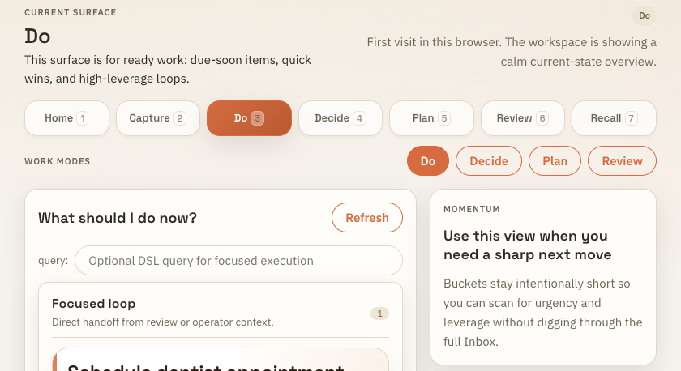
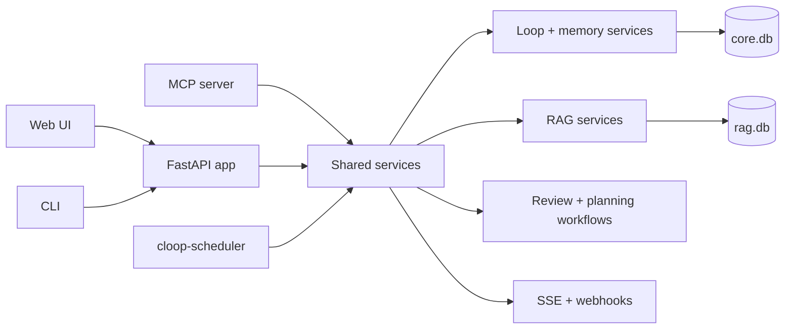

# Cloop

Cloop is a play on “closed loops”: a local assistant for offloading open mental loops into a system you trust, then helping you retrieve, act on, close, or release them without carrying the whole burden in your head.

[](LICENSE)
[](pyproject.toml)



## What you are seeing

The web workspace opens on a focused “Do” surface instead of a full backlog dump:

- **Mode tabs** separate capture, action, decisions, planning, review, and recall.
- **The next-move panel** turns open loops into a small set of due-soon, quick-win, or high-leverage actions.
- **The momentum card** explains the purpose of the current view so the system lowers cognitive load instead of adding another cockpit to manage.
- **Local state** means the same loop data is available through the web UI, CLI, HTTP API, and MCP tools.

That is the core promise: capture what your brain keeps rehearsing, preserve the context locally, and make the next step easy enough that loops can actually close.

## Why “closed loops”

A loop is any unresolved thing your mind keeps reopening: a task, worry, decision, follow-up, reminder, idea, obligation, or piece of context you are afraid to lose. Cloop exists to take those loops out of mental RAM, keep them in a private local system, and help move them toward closure or conscious release.

## Who this is for

Cloop is for people who carry too many unresolved loops and want a private local assistant/tool/agent for:

- offloading tasks, reminders, worries, decisions, and half-formed plans out of working memory;
- turning vague loops into clear next actions, review prompts, or release decisions;
- keeping durable context and preferences outside chat transcripts;
- asking questions over local files with cited retrieval context;
- giving AI agents a narrow, auditable tool surface for local loop and memory operations.

## The problem

The real burden is not just having tasks. It is repeatedly carrying unresolved cognitive state:

1. remembering that something exists;
2. remembering why it matters;
3. remembering the context needed to act;
4. deciding whether it still matters;
5. finding the next step that can close it.

Most tools store items but leave your brain as the persistence layer. Cloop combines capture, memory, retrieval, review, and agent assistance into a local-first loop system. The assistant can help organize and retrieve, but deterministic Python services still own validation, state transitions, idempotency, storage, and undoable writes.

## What it does

| Problem | Cloop capability | Proof surface |
|---|---|---|
| “I need to dump messy thoughts without sorting them first.” | Life/capture flow that turns raw text, voice-style dumps, links, or evidence into structured loops and memory candidates. | Web workspace, `POST /life/message`, `uv run cloop capture ...` |
| “I forget what the next action actually is.” | Loop state model with inbox/actionable/blocked/scheduled/completed states, next actions, due dates, review cohorts, and “Next 5” prioritization. | Web Do/Review tabs, `uv run cloop next`, `/loops/next` |
| “My context is trapped in chat.” | Durable memory CRUD/search shared across web, CLI, HTTP, and MCP. | `uv run cloop memory ...`, memory routes, `memory.*` MCP tools |
| “I want local RAG without standing up infrastructure.” | Recursive ingest, chunking, embeddings, SQLite storage, and grounded ask/chat responses. | `uv run cloop ingest`, `uv run cloop ask`, `/ingest`, `/ask` |
| “Agents need tools but not unchecked authority.” | MCP and HTTP mutation surfaces reuse shared idempotency, validation, provenance, and review/undo contracts. | `cloop-mcp`, shared loop/review/memory services |

Supported ingestion file types: `.txt`, `.md`, `.markdown`, `.pdf`.

## Fastest way to see it work

### 1) Install dependencies

```bash
uv sync --all-groups
pnpm --dir src/cloop/pi_bridge install --frozen-lockfile
pnpm --dir frontend install --frozen-lockfile
cp .env.example .env
```

Prerequisites: Python 3.14+, Node 25.8.2+, pnpm 11.0.9+, `uv`, and an authenticated `pi` installation for generative flows.

### 2) Use the local-first starter config

Edit `.env`. For a first local run, keep automation off and use pi for generation plus Ollama-compatible local embeddings:

```dotenv
CLOOP_PI_MODEL=zai/glm-5.2,kimi-coding/k2p6,openai-codex/gpt-5.5
CLOOP_PI_ORGANIZER_MODEL=zai/glm-5.2,kimi-coding/k2p6,openai-codex/gpt-5.5
CLOOP_PI_SELECTOR_MODE=fallback
CLOOP_PI_CHAT_MAX_TOOL_ROUNDS=4
CLOOP_PI_PLANNING_MAX_TOOL_ROUNDS=2
CLOOP_PI_ENRICHMENT_MAX_TOOL_ROUNDS=2
CLOOP_PI_RAG_MAX_TOOL_ROUNDS=2
CLOOP_PI_MUTATION_MAX_TOOL_ROUNDS=2
CLOOP_EMBED_MODEL=ollama/nomic-embed-text
CLOOP_OLLAMA_API_BASE=http://localhost:11434
CLOOP_AUTOPILOT_ENABLED=false
CLOOP_SCHEDULER_ENABLED=false
```

`fallback` asks `pi --list-models` which selectors are available and picks the first selector that `pi --list-models` reports as available for each role. See [docs/ai_runtime.md](docs/ai_runtime.md) for model selector, tool-budget, retry, streaming, and embedding details.

### 3) Start the app

```bash
make run
```

Open `http://127.0.0.1:8000/` for the web workspace, or `http://127.0.0.1:8000/docs` for Swagger.

### 4) Try the CLI path

```bash
uv run cloop capture "Return Amazon package by Friday" --tz-offset-min -420
uv run cloop loop list --status inbox
uv run cloop next
```

Then try document retrieval:

```bash
uv run cloop ingest ./my-docs
uv run cloop ask "What does the onboarding process say about PTO?" --k 5
```

`cloop ask` returns JSON with `answer`, retrieved `chunks`, `sources`, `metadata`, and a `rerun_action`.

## Proof and verification

- **Local-first data plane**: loop and memory data live in SQLite (`core.db`); retrieval data lives in SQLite (`rag.db`) by default.
- **Transport parity**: web, CLI, HTTP, and MCP reuse shared loop, memory, RAG, review, planning, and idempotency services instead of forked implementations.
- **Local validation**: start with `make help`, use `make check-fast` while iterating, and run `make ci` for the full local release gate.
- **Focused proof**: `make ci` includes quality checks, bridge tests, frontend build/test, Python tests, package build, and metadata validation; use `make test-all` or `make test-performance` when you need performance-marker coverage.

For a guided smoke-test path, use [docs/verification_checklist.md](docs/verification_checklist.md).

## How it works



Key design choices:

- Python owns deterministic state, storage, validation, idempotency, safety checks, and tool execution.
- Generative chat and organizer calls go through the pi bridge.
- Embeddings use a separate LiteLLM-compatible provider path.
- HTTP, CLI, MCP, and web surfaces call the same orchestration contracts for the same capability.

Go deeper:

- [docs/architecture.md](docs/architecture.md) — system shape, data flows, trade-offs.
- [docs/ai_runtime.md](docs/ai_runtime.md) — pi bridge, selector fallback/exact mode, streaming payloads, embeddings.
- [docs/ux/experience-vision.md](docs/ux/experience-vision.md) — intended operator experience.
- [docs/cloop-life-spec.md](docs/cloop-life-spec.md) — product spec for the natural-language Life flow.
- [docs/roadmap.md](docs/roadmap.md) — current product roadmap.

## Current status and limits

- Cloop is designed for local/private use. Do not expose it directly to the public internet without adding your own auth and perimeter controls.
- Generative features require `pi` to be installed, authenticated, and able to resolve the configured model selectors.
- Embedding credentials/configuration are separate from pi chat credentials.
- Scheduler and autopilot automation default to off: `CLOOP_AUTOPILOT_ENABLED=false`, `CLOOP_SCHEDULER_ENABLED=false`.
- Optional SQLite vector extensions are supported, but no external vector database is required.
- The full local gate (`make ci`) excludes tests marked `performance`; use `make test-all` or `make test-performance` when you need those signals.

See [SECURITY.md](SECURITY.md) for security reporting and handling guidance.

## Full setup notes

If you need to wipe the default repo-local SQLite state and reinitialize from scratch:

```bash
make reset-local-data
```

When scheduling is enabled, run it as a separate process:

```bash
cloop-scheduler
```

## Quick reference

- Web app: `make run`, then open `http://127.0.0.1:8000/`
- API docs: `http://127.0.0.1:8000/docs`
- CLI help: `uv run cloop --help`
- MCP server: `uv run cloop-mcp`
- Developer command guide: `make help`

## Detailed reference

Use these references after the quick path when you need exact commands, endpoints, or configuration details:

- [CLI reference](docs/reference.md#cli-reference)
- [Server and API endpoints](docs/reference.md#running-the-server)
- [Web UI workflow](docs/reference.md#web-ui-workflow)
- [Configuration](docs/reference.md#configuration)
- [Webhooks and SSE](docs/reference.md#webhooks-and-sse)
- [MCP server](docs/reference.md#mcp-server)

## Local validation strategy

Validation is local-first and uses maintained `make` targets.

- `make help` shows the short command guide.
- `make check-fast` is the normal development gate.
- `make ci` is the full local release gate: quality checks, bridge tests, frontend build/test, Python tests excluding `performance`, package build, and metadata validation.
- `make test-all`, `make test-cov`, and `make test-performance` are available when you need exhaustive, coverage, or performance-specific signals.

For a guided validation path, use [docs/verification_checklist.md](docs/verification_checklist.md).

## Development

Start with the short command guide:

```bash
make help
```

Most day-to-day work uses:

- `make run` to start the local FastAPI app
- `make check-fast` for rapid iteration
- `make ci` for full local release-grade validation

Use `make help-all` for the full target list, including release, coverage, performance, and maintenance commands.

## Project maintenance docs

- [CONTRIBUTING.md](CONTRIBUTING.md)
- [CHANGELOG.md](CHANGELOG.md)
- [SECURITY.md](SECURITY.md)
- [CODE_OF_CONDUCT.md](CODE_OF_CONDUCT.md)
- [Architecture overview](docs/architecture.md)
- [Reference guide](docs/reference.md)
- [Verification checklist](docs/verification_checklist.md)
- [Release process](docs/release.md)
- [License](LICENSE)

## Release and provenance links

- [Releases](https://github.com/fitchmultz/cloop/releases)
- [Tags](https://github.com/fitchmultz/cloop/tags)

## Next action

Run `make help`, then use `make run` to open the local workspace or `make check-fast` to verify the repo before changing it.
