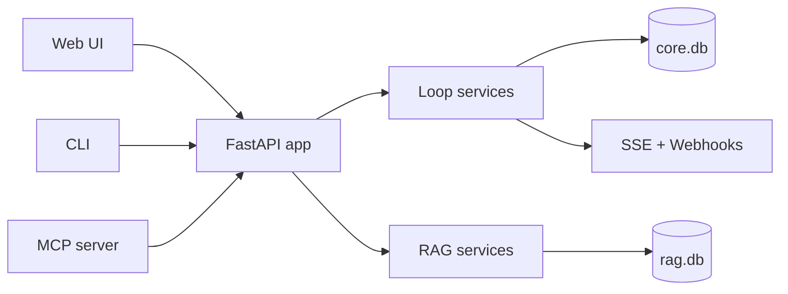

# Cloop (Closed Loop): Your Private, Local-First AI Knowledge Base

[](https://github.com/fitchmultz/cloop/actions/workflows/ci.yml)
[](https://github.com/fitchmultz/cloop/actions/workflows/ci_full.yml)
[](LICENSE)
[](pyproject.toml)

Cloop turns a folder of documents into a private, searchable knowledge base on your machine.
Ingest local files into a lightweight SQLite database, then ask questions with answers grounded in the exact chunks that were retrieved.

No Docker. No external vector database. Your data stays in local SQLite files (`core.db`, `rag.db`).

## Architecture at a glance



- Public architecture summary: [`docs/architecture.md`](docs/architecture.md)
- Detailed design blueprint: [`docs/internal/assistant_blueprint.md`](docs/internal/assistant_blueprint.md)

## Why “Closed Loop”?

Cloop stands for **Closed Loop**.

A **loop** is anything that’s “open” in your mind:

- a task you need to do (big or small)
- a decision you haven’t made yet
- a thread you don’t want to forget (“follow up with…”, “figure out…”, “buy…”, “read…”)

Keeping lots of loops in your head consumes working memory. That mental background load makes it harder to focus, easier to forget things, and more exhausting to start or finish work.

The long-term goal of Cloop is simple: **get loops out of your head and into a trusted local system** that you control — so you can close them deliberately instead of carrying them around.

Today, Cloop is the foundation for that: a private local knowledge base + lightweight persistent memory you can query. The “closed loop” experience is: capture → retrieve → act → confirm → close.

## Design and Architecture

- Start with the concise architecture walkthrough: [docs/architecture.md](docs/architecture.md)
- Dive deeper into design rationale and product blueprint: [docs/internal/assistant_blueprint.md](docs/internal/assistant_blueprint.md)

## Features

- **Local chat**: Talk to an LLM using local runtimes (Ollama / LM Studio) or hosted providers.
- **Private RAG**: Recursively ingest files → chunk → embed → store in SQLite → retrieve relevant context.
- **No heavy infrastructure**: Pure Python + SQLite; optional SQLite vector extensions if you have them.
- **CLI + API**: Use it from the terminal or run a local HTTP server.
- **Persistent “memory”**: Optional `read_note` / `write_note` tools backed by `core.db`.
- **Streaming (SSE)**: Stream `/chat` and `/ask` responses when enabled.
- **Loop capture + inbox**: Guaranteed capture with a simple loop state machine (inbox → actionable/blocked/scheduled → completed).
- **Autopilot suggestions**: Gemini-powered enrichment stored as suggestions with confidence + provenance.
- **Next 5**: Deterministic prioritization for actionable loops.
- **MCP tools**: A purpose-built MCP server that exposes loop operations only.

Supported file types for ingestion: `.txt`, `.md`, `.markdown`, `.pdf`.

## What you can use it for (now)

- **Personal knowledge base**: Drop in docs, notes, PDFs; ask questions later with cited sources.
- **Project recall**: Keep design notes, meeting notes, and decision history in a searchable store.
- **Loop capture (lightweight)**: Use notes as a “working memory dump” so you stop rehearsing open loops.

## The “loops” model (how to think about it)

If you want a simple mental model, treat each loop as having:

- **Trigger**: What caused it to appear? (“Email from…”, “Bug report…”, “Random idea…”)
- **Intent**: What does “completed” mean? (clear definition of closed)
- **Next action**: The smallest step you can do next
- **Context**: Links, filenames, snippets, and references that make it easy to resume later
- **Review cadence**: When should you look at it again? (today, next week, someday)

Cloop’s role is to keep the **context** and make retrieval effortless, so “next action” is the only thing you have to hold in your head.

## Installation

### Prerequisites

- Python 3.11+
- `uv` (recommended): https://docs.astral.sh/uv/

### Setup

```bash
uv sync --all-groups --all-extras
cp .env.example .env
```

Then edit `.env` to point at your model runtime (see Configuration).

### Minimal local-only configuration (recommended first run)

If you want the shortest path to a running local instance, start with:

```dotenv
CLOOP_LLM_MODEL=ollama/llama3
CLOOP_EMBED_MODEL=ollama/nomic-embed-text
CLOOP_OLLAMA_API_BASE=http://localhost:11434
CLOOP_AUTOPILOT_ENABLED=false
CLOOP_SCHEDULER_ENABLED=false
```

This keeps setup predictable while you validate core capture/search/chat flows.

## Security and privacy

- Keep Cloop local by default (`localhost` / trusted private network only).
- Do not expose the service directly to the public internet without adding your own auth and perimeter controls.
- Never commit `.env` or other credential files. Use `.env.example` as your template.
- If a secret is ever exposed, revoke/rotate it immediately.
- See [SECURITY.md](SECURITY.md) for reporting and handling guidance.

## Quick Start (CLI)

Ingest a folder of documents:

```bash
uv run cloop ingest ./my-docs
```

Retrieve the most relevant chunks for a question:

```bash
uv run cloop ask "What does the onboarding process say about PTO?" --k 5
```

Capture a loop and manage your tasks:

```bash
uv run cloop capture "Return Amazon package by Friday" --tz-offset-min -420
uv run cloop loop list --status inbox
uv run cloop loop update 1 --next-action "Go to post office" --due-at "2026-02-15T18:00:00Z"
uv run cloop loop close 1 --note "Done"
uv run cloop next
```

Notes:

- `cloop ask` prints JSON (question + retrieved chunks) for easy piping and inspection.
- For a full LLM-generated answer grounded in those chunks, run the server and use `/ask`.
- Loop lifecycle and utility commands support `--format json|table` (default: `json`).

## Reviewer validation shortcut

If you are evaluating repo quality end-to-end, use:
- [docs/reviewer_validation_checklist.md](docs/reviewer_validation_checklist.md)

## CLI Reference

### Loop Lifecycle Commands

Full loop lifecycle management from the terminal:

```bash
# Get a loop by ID
cloop loop get <id> [--format json|table]

# List loops with filters
cloop loop list [--status STATUS] [--tag TAG] [--limit N] [--offset N] [--format json|table]
# Status options: inbox, actionable, blocked, scheduled, completed, dropped, open (default), all

# Search loops by text
cloop loop search <query> [--limit N] [--offset N] [--format json|table]

# Update loop fields
cloop loop update <id> [OPTIONS] [--format json|table]
  --title TEXT              Update title
  --summary TEXT            Update summary
  --next-action TEXT        Update next action
  --due-at ISO8601          Update due date
  --snooze-until ISO8601    Update snooze time
  --time-minutes N          Estimated time
  --activation-energy N     0-3 scale
  --urgency FLOAT           0.0-1.0
  --importance FLOAT        0.0-1.0
  --project TEXT            Project name
  --blocked-reason TEXT     Reason for blocked status
  --tags TAGS               Comma-separated tags (clears existing)

# Transition loop status
cloop loop status <id> <status> [--note TEXT] [--format json|table]
# Status options: inbox, actionable, blocked, scheduled, completed, dropped

# Close a loop (completed or dropped)
cloop loop close <id> [--dropped] [--note TEXT] [--format json|table]

# Request AI enrichment
cloop loop enrich <id> [--format json|table]

# Snooze a loop
cloop loop snooze <id> <duration> [--format json|table]
# Duration examples: 30m, 1h, 2d, 1w, or ISO8601 timestamp
```

### Utility Commands

```bash
# List all tags in use
cloop tags [--format json|table]

# List all projects
cloop projects [--format json|table]

# Export loops
cloop export [--output FILE] [--format json|table]
# Writes to stdout if no --output specified

# Import loops
cloop import [--file FILE] [--format json|table]
# Reads from stdin if no --file specified
```

### Review Commands

```bash
# View review cohorts (daily by default)
cloop loop review [--format json|table]

# Weekly review only (stale + blocked_too_long)
cloop loop review --weekly --no-daily

# Both daily and weekly
cloop loop review --all

# Limit items per cohort
cloop loop review --limit 5

# Filter to specific cohort
cloop loop review --cohort stale
```

Review cohorts identify loops needing attention:
- **daily**: stale (72h+), no_next_action, blocked_too_long (48h+), due_soon_unplanned (48h)
- **weekly**: stale, blocked_too_long (deeper review subset)

### RAG Commands

```bash
# Ingest documents
cloop ingest <paths...> [--mode MODE] [--no-recursive]
# Mode options: add (default), reindex, purge, sync

# Query knowledge base
cloop ask <question> [--k N] [--scope SCOPE]
```

### Capture Commands

```bash
# Capture a loop
cloop capture <text> [STATUS_FLAGS] [--captured-at ISO8601] [--tz-offset-min N]
# Status flags: --actionable, --scheduled, --blocked
# Aliases: --urgent (same as --actionable), --waiting (same as --blocked)

# View inbox
cloop inbox [--limit N]

# View next actions (prioritized)
cloop next [--limit N]
```

### Exit Codes

- `0`: Success
- `1`: Validation error (invalid arguments, no fields to update, etc.)
- `2`: Not found error (loop not found, invalid transition, etc.)

### Example Workflows

**Capture and complete a task:**
```bash
uv run cloop capture "Review PR #123" --actionable
uv run cloop loop update 1 --next-action "Open PR" --due-at "2026-02-14T17:00:00Z"
uv run cloop loop list --status actionable
uv run cloop loop close 1 --note "Approved and merged"
```

**Export and import data:**
```bash
uv run cloop export --output backup.json
uv run cloop import --file backup.json
```

**Search and update:**
```bash
uv run cloop loop search "groceries"
uv run cloop loop update 5 --tags "shopping,weekly"
```

## Running the Server

Start the local service:

```bash
uv run uvicorn cloop.main:app --reload
```

Then open `http://127.0.0.1:8000/` for the Quick Capture UI.

Endpoints:

- `GET /docs`: interactive Swagger UI for all API operations.
- `GET /redoc`: ReDoc-style API reference.
- `GET /openapi.json`: machine-readable OpenAPI schema.
- `POST /chat`: chat completion (optionally with tools); `?stream=true` for SSE streaming.
- `POST /ingest`: ingest local files/folders into `rag.db`.
- `GET /ask`: RAG question answering; returns an answer plus `sources` pointing at the retrieved chunks.
- `GET /health`: shows current model + storage configuration.
- `POST /loops/capture`: capture a loop (write-first).
- `GET /loops`: list loops (default inbox).
- `GET /loops/{id}`: fetch a loop.
- `PATCH /loops/{id}`: update loop fields.
- `POST /loops/{id}/close`: close a loop (completed or dropped).
- `POST /loops/{id}/enrich`: request enrichment for a loop.
- `GET /loops/next`: deterministic “Next 5” buckets.
- `GET /loops/tags`: list all tags in use.
- `GET /loops/events/stream`: SSE stream of loop events (capture, update, status changes, enrichment).
- `POST /loops/webhooks/subscriptions`: create webhook subscription for outbound events.
- `GET /loops/webhooks/subscriptions`: list webhook subscriptions.
- `PATCH /loops/webhooks/subscriptions/{id}`: update a webhook subscription.
- `DELETE /loops/webhooks/subscriptions/{id}`: delete a webhook subscription.
- `GET /loops/webhooks/subscriptions/{id}/deliveries`: list delivery history for a subscription.

Example requests:

```bash
curl -X POST http://127.0.0.1:8000/ingest \
  -H 'content-type: application/json' \
  -d '{"paths":["./my-docs"],"mode":"add","recursive":true}'

curl 'http://127.0.0.1:8000/ask?q=What%20is%20Cloop%3F&k=5'
```

## Web UI Workflow

Open `http://127.0.0.1:8000/` after starting the server for a keyboard-driven loop management interface.

### Tabs

| Tab | Purpose |
|-----|---------|
| **Inbox** (1) | Quick capture and loop list with filters |
| **Next** (2) | Prioritized "what should I do now?" buckets |
| **Chat** (3) | LLM conversation interface |
| **RAG** (4) | Query your knowledge base |
| **Review** (5) | Daily/weekly review cohorts |
| **Metrics** (6) | Loop health statistics |

### Quick Capture

The Inbox tab provides instant capture:
1. Type your loop text in the textarea
2. Optionally set status flags: Actionable, Scheduled, Blocked
3. Press Enter or click Save

Captures are persisted immediately with offline sync support.

### Review Cohorts

The Review tab groups loops needing attention:

**Daily cohorts**:
- **stale**: Loops not updated in 72+ hours
- **no_next_action**: Actionable loops without a defined next step
- **blocked_too_long**: Blocked for 48+ hours
- **due_soon_unplanned**: Due within 48 hours but no next action

**Weekly cohorts**: Subset of daily (stale, blocked_too_long) for deeper review.

### Keyboard Shortcuts

Press `?` in the web UI to see all shortcuts:

| Action | Keys |
|--------|------|
| New loop (focus capture) | `n` |
| Search/query | `/` |
| Complete selected | `c` |
| Enrich selected | `e` |
| Refresh | `r` |
| Toggle timer | `t` |
| Snooze | `s` |
| Switch tabs | `1`-`6` |
| Go to Inbox/Next/Chat/RAG/Review/Metrics | `g i` / `g n` / `g c` / `g r` / `g v` / `g m` |
| Select all visible | `Ctrl+A` |
| Clear selection | `Esc` |
| Show help | `?` |

### Bulk Operations

Select multiple loops (Shift+Click for range, Ctrl+A for all) to:
- Complete / Drop
- Change status
- Snooze
- Add tags

## Configuration

Cloop reads configuration from environment variables (a `.env` file works well).

### Choose your models

- `CLOOP_LLM_MODEL`: chat model (default: `ollama/llama3`)
- `CLOOP_EMBED_MODEL`: embedding model used for RAG (default: `ollama/nomic-embed-text`)
- `CLOOP_ORGANIZER_MODEL`: organizer model used for loop enrichment (default: `gemini/gemini-3-flash-preview`)

### Local models (recommended)

Ollama:

- `CLOOP_OLLAMA_API_BASE` (required when using `ollama/...`, e.g. `http://localhost:11434`)

LM Studio:

- `CLOOP_LMSTUDIO_API_BASE` (e.g. `http://localhost:1234/v1`)

### Hosted providers

OpenAI-compatible:

- `CLOOP_OPENAI_API_KEY` (required for `CLOOP_LLM_MODEL` values like `gpt-...` / `openai/...`)
- `CLOOP_OPENAI_API_BASE` (optional; for compatible gateways)

Gemini:

- `CLOOP_GOOGLE_API_KEY` (required for `gemini/...` organizer models)

OpenRouter:

- `CLOOP_OPENROUTER_API_BASE` (optional; for OpenRouter routing)

### Where your data lives

- `CLOOP_DATA_DIR`: directory for `core.db` and `rag.db` (default: `./data`)
- `CLOOP_CORE_DB_PATH`, `CLOOP_RAG_DB_PATH`: override individual DB paths

### RAG behavior

- `CLOOP_DEFAULT_TOP_K`: number of chunks to retrieve (default: `5`)
- `CLOOP_CHUNK_SIZE`: chunk size in tokens/words-ish units (default: `800`)
- `CLOOP_VECTOR_MODE`: `python` (default), `sqlite`, or `auto`
- `CLOOP_EMBED_STORAGE`: `json`, `blob`, or `dual` (default: `dual`)
  - Note: `CLOOP_VECTOR_MODE=sqlite` requires `CLOOP_EMBED_STORAGE=json` or `dual`.
- `CLOOP_SQLITE_VECTOR_EXTENSION`: optional path to a SQLite vector extension, if you have one.

### Tools (“memory” notes)

- `CLOOP_TOOL_MODE`: `manual`, `llm`, or `none` (default: `manual`)
  - `manual`: you must send a `tool_call` to `/chat` (e.g., `read_note`, `write_note`)
  - `llm`: the model can call tools automatically
  - `none`: tools disabled
- `CLOOP_STREAM_DEFAULT`: set to `true` to stream by default (note: streaming is disallowed when tool mode is `llm`)

#### Note Discovery Tools

Notes support enumeration and search via tool operations:

- `list_notes`: List all stored notes with pagination
- `search_notes`: Search notes by text (matches title and body)

Example chat usage:
```json
{"tool_call": {"name": "list_notes", "arguments": {"limit": 10}}}
{"tool_call": {"name": "search_notes", "arguments": {"query": "meeting notes"}}}
```

Both operations return:
- `items`: Array of note objects with id, title, body, created_at, updated_at
- `next_cursor`: Pagination cursor for fetching more results (null if no more)
- `limit`: The limit used for this query

### Organizer autopilot

- `CLOOP_ORGANIZER_TIMEOUT`: organizer request timeout (default: `20.0`)
- `CLOOP_AUTOPILOT_ENABLED`: enable loop enrichment (default: `true`)
- `CLOOP_AUTOPILOT_AUTOAPPLY_MIN_CONFIDENCE`: auto-apply threshold (default: `0.85`)

### Idempotency (safe retries)

All mutating endpoints support idempotency for safe retries over unreliable networks:

- `CLOOP_IDEMPOTENCY_TTL_SECONDS`: retention window for idempotency keys (default: `86400` = 24 hours)
- `CLOOP_IDEMPOTENCY_MAX_KEY_LENGTH`: max key length (default: `255`)

**HTTP API**: Include `Idempotency-Key` header with any mutating request (POST/PATCH).
- Same key + same payload: replays prior response without additional writes
- Same key + different payload: returns 409 Conflict

**MCP tools**: Pass `request_id` argument to any mutation tool (`loop.create`, `loop.update`, `loop.close`, `loop.transition`, `loop.snooze`, `loop.enrich`).
- Same request_id + same args: replays prior response
- Same request_id + different args: raises `ToolError`

Example HTTP retry:
```bash
curl -X POST http://127.0.0.1:8000/loops/capture \
  -H 'content-type: application/json' \
  -H 'Idempotency-Key: my-unique-key-123' \
  -d '{"raw_text": "Buy groceries", "captured_at": "2026-02-13T10:00:00Z", "client_tz_offset_min": 0}'
```

Example MCP tool call with idempotency:
```python
loop_create(
    raw_text="Buy groceries",
    captured_at="2026-02-13T10:00:00Z",
    client_tz_offset_min=0,
    request_id="my-unique-key-123"
)
```

## Webhooks and SSE

Cloop supports real-time event delivery via webhooks (outbound HTTP) and SSE (Server-Sent Events).

### Server-Sent Events (SSE)

Stream loop events in real-time:

```bash
curl -N http://127.0.0.1:8000/loops/events/stream
```

**Reconnection support**: Pass `Last-Event-ID` header or `?cursor=` query param to resume from a specific event ID:

```bash
curl -N -H "Last-Event-ID: 42" http://127.0.0.1:8000/loops/events/stream
```

**Event types**:
- `capture`: New loop created
- `update`: Loop fields modified
- `status_change`: Status transition
- `close`: Loop completed or dropped
- `enrich_request`/`enrich_success`: Enrichment lifecycle

### Webhooks

Register HTTPS endpoints to receive loop events with HMAC-SHA256 signatures.

**Create a subscription**:

```bash
curl -X POST http://127.0.0.1:8000/loops/webhooks/subscriptions \
  -H 'content-type: application/json' \
  -d '{
    "url": "https://example.com/webhook",
    "event_types": ["capture", "update", "close"],
    "description": "My webhook"
  }'
```

Response includes a `secret` for signature verification. Store this securely.

**Webhook security model**:

- **HTTPS only**: Only HTTPS URLs are accepted (no HTTP)
- **HMAC-SHA256 signatures**: Each payload is signed with the subscription secret
- **Replay protection**: Signatures include timestamps valid for ±5 minutes
- **Exponential backoff**: Failed deliveries retry with jitter (3 retries by default)
- **Dead letter tracking**: Failed deliveries after max retries are preserved for inspection

**Signature verification** (Python example):

```python
import hmac
import hashlib
import json
import time

def verify_webhook(payload: dict, secret: str, signature_header: str) -> bool:
    """Verify webhook signature with replay protection."""
    # Header format: t=<timestamp>,v1=<hex_signature>
    parts = signature_header.split(",")
    timestamp = parts[0].split("=")[1]
    
    # Check timestamp is recent (prevent replay attacks)
    if abs(int(timestamp) - int(time.time())) > 300:
        return False
    
    # Reconstruct expected signature
    payload_bytes = json.dumps(payload, separators=(",", ":")).encode("utf-8")
    signed_payload = f"{timestamp}.{payload_bytes.decode()}".encode("utf-8")
    expected_sig = hmac.new(
        secret.encode(),
        signed_payload,
        hashlib.sha256
    ).hexdigest()
    expected = f"t={timestamp},v1={expected_sig}"
    
    return hmac.compare_digest(expected, signature_header)
```

**Webhook headers**:
- `X-Webhook-Signature`: `t=<timestamp>,v1=<signature>`
- `X-Webhook-Event`: Event type (e.g., `capture`)
- `X-Webhook-Event-Id`: Loop event ID for idempotency

**Configuration**:

- `CLOOP_WEBHOOK_MAX_RETRIES`: Max retry attempts (default: 3)
- `CLOOP_WEBHOOK_RETRY_BASE_DELAY`: Initial retry delay in seconds (default: 5.0)
- `CLOOP_WEBHOOK_RETRY_MAX_DELAY`: Max retry delay cap (default: 300.0)
- `CLOOP_WEBHOOK_TIMEOUT_SECONDS`: HTTP request timeout (default: 30.0)

## MCP Server

Run the MCP server (stdio transport):

```bash
uv run cloop-mcp
```

Exposed tools include `loop.create`, `loop.update`, `loop.close`, `loop.get`, `loop.next`,
`loop.transition`, `loop.tags`, `loop.list`, `loop.search`, `loop.snooze`, `loop.enrich`,
and `project.list`.

## CI and test strategy

Cloop intentionally separates fast PR checks from deeper full-suite checks to avoid saturating developer machines and CI runners.

- **PR required (`.github/workflows/ci.yml`)**
  - `make quality`
  - `make test-fast` (excludes `slow` and `performance` markers)
- **Main/nightly/manual (`.github/workflows/ci_full.yml`)**
  - `make ci` (full gate)
  - compatibility fast tests on additional Python versions
  - `make test-cov` (coverage artifact)
  - `make test-performance` (nightly/manual)

Detailed CI behavior, runtime targets, and resource controls:
- [docs/ci_strategy.md](docs/ci_strategy.md)

## Development

- `make sync` (upgrade deps)
- `make check-fast` for rapid iteration
- `make ci` for release-grade validation
- `make test-cov` for coverage reporting

## Project maintenance docs

- [CONTRIBUTING.md](CONTRIBUTING.md)
- [CHANGELOG.md](CHANGELOG.md)
- [SECURITY.md](SECURITY.md)
- [CODE_OF_CONDUCT.md](CODE_OF_CONDUCT.md)
- [Architecture overview](docs/architecture.md)
- [CI strategy and resource controls](docs/ci_strategy.md)
- [Reviewer validation checklist](docs/reviewer_validation_checklist.md)
- [Release readiness report](docs/release_readiness_report.md)
- [Optional private-repo history rewrite plan](docs/history_rewrite_plan.md)
- [Release process](docs/release.md)
- [Public release checklist](docs/public_release_checklist.md)
- [License](LICENSE)

## Release and provenance links

- [Releases](https://github.com/fitchmultz/cloop/releases)
- [Tags](https://github.com/fitchmultz/cloop/tags)
- [CI workflow (PR fast)](.github/workflows/ci.yml)
- [CI workflow (full main/nightly)](.github/workflows/ci_full.yml)
- [Release workflow](.github/workflows/release.yml)
