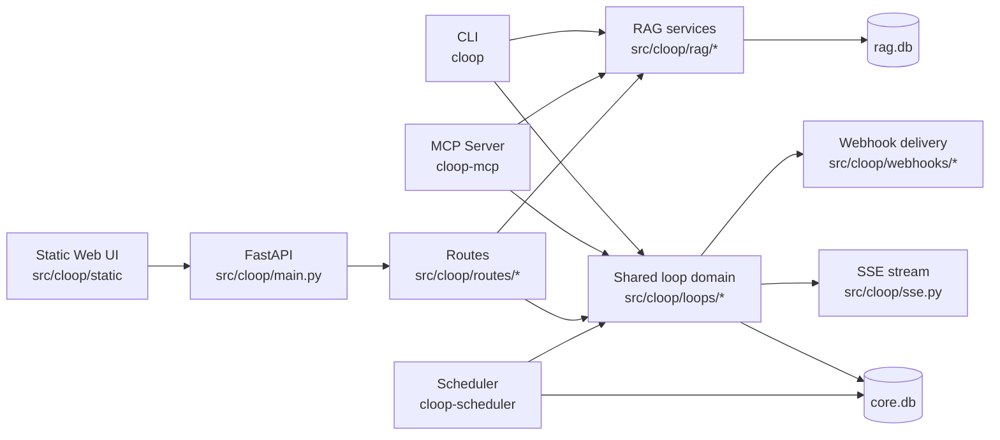

# Cloop Architecture Overview

This document is the public architecture summary for how Cloop actually works.
Pair it with [`docs/verification_checklist.md`](verification_checklist.md) for setup and validation commands.

## 1) System shape

Cloop is a local-first FastAPI service with three primary interfaces:

- **HTTP API** (FastAPI routes under `src/cloop/routes/*`)
- **CLI** (`src/cloop/cli.py`, `src/cloop/cli_package/*`)
- **MCP server** (`src/cloop/mcp_server.py`, tools in `src/cloop/mcp_tools/*`)

All interfaces converge on shared domain/service/repository logic in `src/cloop/loops/*` and `src/cloop/rag/*`.
Persistent state is local SQLite (`core.db`, `rag.db`), not an external database service. The scheduler is a separate local process (`cloop-scheduler`) that coordinates through SQLite leases and execution markers.

## 2) Core components

### API boundary
- `src/cloop/main.py`: app bootstrap, lifespan, router registration, health endpoint.
- `src/cloop/routes/*`: HTTP request/response wiring and schema mapping.

### Domain logic
- `src/cloop/loops/service.py`: loop lifecycle operations and state transitions.
- `src/cloop/loops/write_ops.py`: canonical write-operation helpers and mutation invariants.
- `src/cloop/loops/repo.py`: SQL-focused persistence operations.
- `src/cloop/loops/prioritization.py`, `review.py`, `timers.py`, `claims.py`: specialized loop behavior.
- `src/cloop/storage/*`: feature-owned persistence for notes, memory, idempotency, interaction logs, and scheduler state.

### Retrieval + generation
- `src/cloop/rag/*`: ingestion, chunking, embeddings, vector search order, and retrieval composition.
- `src/cloop/chat_orchestration.py`: shared grounded chat request preparation (loop, memory, and RAG context assembly).
- `src/cloop/chat_execution.py`: shared chat execution contract used by HTTP and CLI for tool handling, response shaping, streaming, and interaction logging.
- `src/cloop/llm.py`, `src/cloop/ai_bridge/*`, `src/cloop/pi_bridge/*`: pi-backed generative runtime, bridge protocol, and Node bridge implementation.
- `src/cloop/embeddings.py`, `src/cloop/embedding_providers.py`: embeddings-only LiteLLM path and provider resolution.
- `docs/ai_runtime.md`: operational reference for the bridge boundary, protocol, health semantics, and failure modes.

### Real-time/eventing
- `src/cloop/sse.py`: server-sent events fan-out for loop events.
- `src/cloop/webhooks/*`: signed webhook subscriptions and delivery/retry behavior.
- `src/cloop/scheduler.py`: dedicated-process periodic review/nudge routines.

## 3) Data and control flow examples

### Capture a loop (HTTP)
1. Client sends `POST /loops/capture`.
2. Route validates payload via schema.
3. Service layer applies lifecycle rules and writes to `core.db`.
4. Event is emitted to SSE subscribers and webhook pipeline.
5. API returns created loop record.

### Ask with RAG
1. Client ingests documents (`/ingest`) and asks (`/ask`).
2. RAG module loads/chunks/embeds and stores vectors in `rag.db`.
3. Retrieval selects candidate chunks and assembles source context.
4. The Python app sends request-scoped messages to the local pi bridge and returns the generated answer with explicit source payload.

### Grounded chat (HTTP + CLI)
1. HTTP `/chat` and `cloop chat` both build the same `ChatRequest`-shaped payload.
2. `src/cloop/chat_orchestration.py` resolves effective options and builds loop/memory/RAG grounding.
3. `src/cloop/chat_execution.py` runs manual tools or bridge-backed chat/tool loops and shapes the canonical response.
4. Transport-specific layers only handle formatting (JSON/SSE/text), not chat semantics.

### MCP loop mutation
1. MCP tool call maps directly to the shared loop service operation.
2. Optional idempotency key (`request_id`) guards repeated mutations.
3. Service/repo persist state changes; event stream/webhooks reflect updates.

## 4) Key design decisions and trade-offs

### Local-first data plane
**Decision:** keep data in local SQLite files (`core.db`, `rag.db`).

- **Pros:** easy setup, private-by-default posture, no infrastructure tax.
- **Trade-offs:** single-node scale profile and operational boundaries versus managed DB services.

### Shared service layer across interfaces
**Decision:** API/CLI/MCP reuse the same domain modules.

- **Pros:** consistent behavior and reduced logic drift.
- **Trade-offs:** clearer boundaries are required to avoid route/CLI-specific concerns leaking into shared services.

### Deterministic + assisted workflow model
**Decision:** deterministic lifecycle/prioritization with optional LLM enrichment/autopilot.

- **Pros:** predictable core behavior with optional AI assistance.
- **Trade-offs:** requires explicit confidence thresholds and robust fallbacks when providers fail.

## 5) Operational notes

- **Health:** `GET /health` reports pi bridge readiness, chat/organizer model selectors, embedding model, storage mode, and bridge metadata (`bridge_name`, `bridge_version`, `bridge_protocol`).
- **Scheduler runtime:** run `cloop-scheduler` separately from the FastAPI app when scheduler automation is enabled.
- **Local CI gate:** `make ci` (quality, tests, packaging checks).
- **Fast dev gate:** `make check-fast` (quality + fast tests).
- **Release-grade artifacts:** `make dist-check` validates build metadata before release publishing.

## 6) Why the MCP surface matters

The MCP server is a meaningful part of the project, not a sidecar demo.

- It exposes loop operations through a narrow domain-specific tool boundary.
- It reuses the same service/repository logic as the API and CLI.
- It avoids giving agents raw SQL or overly broad host access for common loop workflows.

That makes Cloop a practical example of agent-tool integration in a real application, not just a standalone chat/RAG demo.

## 7) Where to go next in code

- API bootstrap: `src/cloop/main.py`
- Settings/config loading: `src/cloop/settings.py`
- Loop lifecycle core: `src/cloop/loops/service.py`
- RAG ingest/retrieval: `src/cloop/rag/*`
- CI and release automation: `.github/workflows/*.yml`
