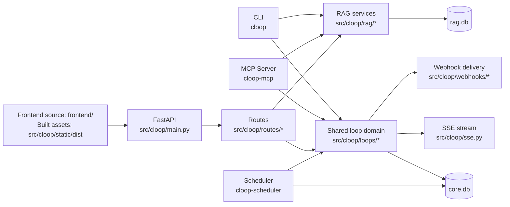

# Cloop Architecture Overview

This document is the public architecture summary for how Cloop actually works.
Pair it with [`docs/verification_checklist.md`](verification_checklist.md) for setup and validation commands.

## 1) System shape

Cloop is a local-first FastAPI service with three primary interfaces:

- **HTTP API** (FastAPI routes under `src/cloop/routes/*`)
- **CLI** (`src/cloop/cli.py`, `src/cloop/cli_package/*`)
- **MCP server** (`src/cloop/mcp_server.py`, tools in `src/cloop/mcp_tools/*`)

All interfaces converge on shared domain/service/repository logic in `src/cloop/loops/*`, `src/cloop/rag/*`, and shared top-level execution/orchestration modules such as `src/cloop/chat_execution.py`, `src/cloop/rag_execution.py`, and `src/cloop/memory_management.py`.
Persistent state is local SQLite (`core.db`, `rag.db`), not an external database service. The scheduler is a separate local process (`cloop-scheduler`) that coordinates through SQLite leases and execution markers.

## 2) Core components

### API boundary
- `src/cloop/main.py`: app bootstrap, lifespan, router registration, health endpoint.
- `src/cloop/routes/*`: HTTP request/response wiring and schema mapping.

### Domain logic
- `src/cloop/life_orchestration.py`: pi-organizer-backed Life agent orchestration for messy capture, source-evidence preservation, likely-duplicate updates, grouped resurfacing, preference/pattern-memory capture, and undoable cleanup on top of the shared loop and memory services.
- `src/cloop/loops/service.py`: loop lifecycle operations and state transitions.
- `src/cloop/loops/write_ops.py`: canonical write-operation helpers and mutation invariants.
- `src/cloop/loops/repo.py`: SQL-focused persistence operations.
- `src/cloop/loops/enrichment_review.py`: shared suggestion/clarification review contract used by HTTP, web, CLI, and MCP after enrichment runs.
- `src/cloop/loops/relationship_review.py`: shared duplicate/related-loop review contract used by HTTP, web, CLI, and MCP on top of semantic similarity.
- `src/cloop/loops/review_workflows.py`: shared saved review-action + saved review-session contract used by HTTP, web, CLI, and MCP for session-preserving filtered relationship/enrichment review.
- `src/cloop/memory_management.py`: shared direct memory-management contract used by HTTP, web, CLI, MCP, and memory tool executors.
- `src/cloop/loops/read_service.py`, `src/cloop/loops/similarity.py`: shared semantic-loop search contract plus canonical loop-embedding/source-hash maintenance for on-demand backfill.
- `src/cloop/loops/prioritization.py`, `review.py`, `timers.py`, `claims.py`: specialized loop behavior.
- `src/cloop/storage/*`: feature-owned persistence for notes, memory, idempotency, interaction logs, and scheduler state.

### Retrieval + generation
- `src/cloop/rag/*`: ingestion, chunking, embeddings, vector search order, and retrieval composition.
- `src/cloop/rag_execution.py`: shared RAG ingest/ask execution contract used by HTTP, CLI, and MCP for validation, response shaping, streaming, and interaction logging.
- `src/cloop/chat_orchestration.py`: shared grounded chat request preparation (loop, memory, and RAG context assembly).
- `src/cloop/chat_execution.py`: shared chat execution contract used by HTTP, CLI, and MCP for tool handling, response shaping, streaming, and interaction logging.
- `src/cloop/llm.py`, `src/cloop/ai_bridge/*`, `src/cloop/pi_bridge/*`: pi-backed generative runtime, bridge protocol, and Node bridge implementation.
- `src/cloop/embeddings.py`, `src/cloop/embedding_providers.py`: embeddings-only LiteLLM path and provider resolution.
- `docs/ai_runtime.md`: operational reference for the bridge boundary, protocol, health semantics, and failure modes.

### Real-time/eventing
- `src/cloop/sse.py`: server-sent events fan-out for loop events.
- `src/cloop/webhooks/*`: signed webhook subscriptions and delivery/retry behavior.
- `src/cloop/scheduler.py`: dedicated-process periodic review/nudge routines. Slot ownership and dedupe are deterministic; Life garden, due-soon, and stale-rescue judgment delegate to the Life organizer.

## 3) Data and control flow examples

### Capture a loop (HTTP)
1. Client sends `POST /loops/capture`.
2. Route validates payload via schema.
3. Service layer applies lifecycle rules and writes to `core.db`.
4. Event is emitted to SSE subscribers and webhook pipeline.
5. API returns created loop record.

### Life message (HTTP + Web)
1. The Life feed collects typed or browser-dictated text plus lightweight external source metadata from pasted links or attached screenshots/photos/audio/files, then sends one natural-language message to `POST /life/message`.
2. `src/cloop/life_orchestration.py` builds grounded context from current loops, recent history, durable memory, external input metadata, and raw factual Life evidence such as timestamps, next-action presence, snooze timing, deferral counts, user/agent touch timestamps, dependency IDs, resurfacing history, and recent loop events.
3. The pi organizer returns a validated JSON Life plan that classifies the message as capture, resurfacing, cleanup, or preference memory; it owns the judgment for splitting loops, detecting and merging likely duplicates, linking related context, adding or removing blocker/dependency links, preparing next actions and draft artifacts such as scripts, shortlists, route suggestions, and appointment prep, asking optional clarifications, interpreting answers to pending clarification rows, deciding what is stale or low-risk, rescheduling or marking loops waiting/active, moving/compressing memory layers, grouping what matters, attaching useful source-evidence labels to captures/updates, and deciding whether a background digest should interrupt the user.
4. The deterministic layer only validates loop IDs/fields and agent-returned authority/risk/source-evidence claims, writes captures and updates through shared loop services, persists agent-selected external source evidence in loop provenance, records related/duplicate context through the canonical `loop_links` table, calls canonical merge, dependency, and memory-management services when the agent chooses those actions, applies delegated internal cleanup through normal loop updates/transitions plus existing undo events, and delivers push notifications only when the agent explicitly requested one with notification copy.
5. Background Life scheduler slots use the same contract. The scheduler does not rank due-soon loops, decide staleness, assign escalation levels, or write nudge copy; it records the agent response and sends a digest only when `notify_user` is true.
6. Resurfacing writes lightweight `life_resurfaced` loop events, giving future Life turns a real last-seen trail without treating chat history as canonical state.
7. Clarification questions and answers persist on the existing loop clarification rows, so a later Life message such as “actually Costco” can update the right loop without making chat history the source of truth.
8. Preference, pattern, person, event, and context memories persist through the shared memory-management path with `life_layer` metadata (`active`, `warm`, or `cold`) so future chat and Life behavior can ground on the right level of continuity without flattening everything into one memory bucket.

### Ask with RAG (HTTP + CLI + MCP)
1. Any transport invokes the shared RAG execution contract with ingest or ask inputs.
2. `src/cloop/rag_execution.py` validates the request, delegates retrieval preparation to `src/cloop/rag/ask_orchestration.py`, and records interaction logs.
3. RAG modules load/chunk/embed/store content in `rag.db`, or retrieve candidate chunks and assemble source context.
4. When knowledge is available, the Python app sends request-scoped messages to the local pi bridge and returns the generated answer with `chunks`, `sources`, `metadata`, and `rerun_action`.

### Grounded chat (HTTP + CLI + MCP)
1. HTTP `/chat`, `cloop chat`, and MCP `chat.complete` all build the same `ChatRequest`-shaped payload.
2. `src/cloop/chat_orchestration.py` resolves effective options and builds loop/memory/RAG grounding.
3. `src/cloop/chat_execution.py` runs manual tools or bridge-backed chat/tool loops and shapes the canonical response.
4. Surface-specific layers only handle transport details (HTTP JSON/SSE, CLI text rendering, or MCP tool registration), not chat semantics.

### Suggestion and clarification review (HTTP + Web + CLI + MCP)
1. Enrichment persists a suggestion row plus clarification question rows for follow-up review.
2. `src/cloop/loops/enrichment_review.py` reads suggestion payloads, links them to persisted clarification IDs, and owns apply/reject/answer semantics.
3. HTTP routes, the web UI, CLI commands, and MCP tools all reuse that shared contract instead of inventing transport-specific clarification payloads.
4. Answering clarifications targets existing clarification rows and supersedes stale clarification-dependent suggestions before the next enrichment pass.

### Direct memory management (HTTP + Web + CLI + MCP)
1. HTTP `/memory/*`, the web memory tab, `cloop memory *`, and MCP `memory.*` all call `src/cloop/memory_management.py`.
2. `src/cloop/memory_management.py` owns category/source/priority validation, query semantics, and explicit update-field presence rules such as clearing `key`; categories include preferences, patterns, people, events, generic context, commitments, and facts.
3. `src/cloop/storage/memory_store.py` stays persistence-only, including cursor pagination and JSON metadata serialization.
4. Chat grounding continues to read from the same durable memory substrate rather than maintaining transport-specific memory state.

### Semantic loop search (HTTP + Web + CLI + MCP)
1. HTTP `/loops/search/semantic`, the Inbox semantic mode, `cloop loop semantic-search`, and MCP `loop.semantic_search` all call `src/cloop/loops/read_service.py::semantic_search_loops`.
2. `src/cloop/loops/similarity.py` owns the canonical loop-to-embedding source text, source-hash comparison, and on-demand embedding refresh.
3. Search requests backfill missing or stale loop embeddings before scoring, so older loops stay searchable without introducing transport-specific indexing code.
4. Internal related/duplicate workflows can reuse the same loop-embedding substrate instead of inventing parallel semantic contracts.

### Continuity delivery diagnostics (HTTP + CLI + MCP)
1. HTTP `/loops/continuity/debug/delivery-decisions`, `cloop continuity delivery-decisions`, and MCP `continuity.delivery_decisions` all call `src/cloop/storage/continuity_store.py::read_continuity_delivery_inspection`.
2. `src/cloop/storage/continuity_store.py` owns the bounded diagnostics scan, opaque cursor contract, sendability reason vocabulary, resend timing, and latest scheduler-push provenance.
3. Push selection reuses that same bounded diagnostics substrate through `read_continuity_notification_records(...)`, so scheduler/browser delivery behavior stays aligned with debug inspection instead of drifting into a separate policy.
4. Surface-specific layers should only add transport ergonomics (JSON, table rendering, tool registration) downstream of the shared diagnostics payload.

### Relationship review (HTTP + Web + CLI + MCP)
1. HTTP relationship-review endpoints, the Review tab, `cloop loop relationship *`, and MCP `loop.relationship_*` all call `src/cloop/loops/relationship_review.py`.
2. `src/cloop/loops/relationship_review.py` owns duplicate-vs-related classification, cross-loop review queues, confirm/dismiss decisions, and merge-resolution state updates.
3. `src/cloop/loops/read_service.py` + `src/cloop/loops/similarity.py` remain the only owners of embedding source text, source-hash upkeep, and similarity scoring.
4. Relationship decisions persist in `loop_links` with explicit `link_state` (`active`, `dismissed`, `resolved`) so review outcomes survive later suggestion refreshes.

### Saved review workflows (HTTP + Web + CLI + MCP)
1. HTTP `/loops/review/*`, the Review tab session workspaces, `cloop review *`, and MCP `review.*` all call `src/cloop/loops/review_workflows.py`.
2. `src/cloop/loops/review_workflows.py` owns saved review-action presets, saved review-session persistence, filtered worklist snapshots, cursor preservation, and session-scoped relationship/enrichment action execution.
3. Relationship session snapshots delegate candidate generation back to `src/cloop/loops/relationship_review.py`, and enrichment session snapshots delegate suggestion/clarification hydration back to `src/cloop/loops/enrichment_review.py`.
4. The web Review tab should treat saved sessions as the source of truth for session worklist state instead of rebuilding ad-hoc queue filters client-side.

### Planning workflows (HTTP + Web + CLI + MCP)
1. HTTP `/loops/planning/*`, the Review tab planning workspace, `cloop plan session *`, and MCP `plan.session.*` all call `src/cloop/loops/planning_workflows.py`.
2. `src/cloop/loops/planning_workflows.py` owns grounded plan generation, durable planning-session persistence, checkpoint cursors, execution history, refresh semantics, and deterministic checkpoint execution.
3. Persisted session metadata lives in `planning_sessions`, and executed checkpoint snapshots live in `planning_session_runs`, so operators can inspect prior results without relying on transport-local state.
4. Checkpoint execution may compose existing shared deterministic primitives such as loop capture/update/status transitions, query-bulk loop mutations, saved views/templates, explicit enrichment orchestration, and saved review-session creation instead of inventing transport-specific workflow forks.
5. Executed checkpoints should persist transparent provenance plus operator handoff metadata: `execution.summary`, `resource_change_summary`, `follow_up_resources`, `launch_surfaces`, `rollback_cues`, and `undo_action`, so transports can explain what changed and open the next saved review-session queue without rebuilding ad-hoc bookkeeping.
6. Transport ergonomics should stay layered on top of that shared substrate: the Review tab should surface plan freshness, focus loops, rollback cues, execution outputs, and next-step launch surfaces clearly, while MCP tool descriptions should teach operators how planning hands off into saved review sessions and grounded chat.

### Bulk enrichment (HTTP + Web + CLI + MCP)
1. Explicit bulk enrichment routes through `src/cloop/loops/enrichment_orchestration.py` instead of letting each transport loop over single-item enrichment on its own.
2. `src/cloop/loops/enrichment_orchestration.py` owns selected-loop bulk execution, query-target preview, and query-driven bulk enrichment for filtered loop sets.
3. HTTP `/loops/bulk/enrich` and `/loops/bulk/query/enrich`, the Review tab bulk-enrichment panel, the Inbox bulk `Enrich` action, `cloop loop bulk enrich`, and MCP `loop.bulk_enrich*` all reuse that shared contract.
4. Prompt construction, suggestion persistence, clarification generation, and relationship-sync follow-up remain owned by `src/cloop/loops/enrichment.py`; bulk orchestration layers on top instead of forking enrichment behavior.

### MCP loop mutation
1. MCP tool call maps directly to the shared loop service operation.
2. Optional idempotency key (`request_id`) guards repeated mutations.
3. Service/repo persist state changes; event stream/webhooks reflect updates.

## 4) Key design decisions and trade-offs

### Local-first data plane
**Decision:** keep data in local SQLite files (`core.db`, `rag.db`).

- **Pros:** easy setup, private-by-default posture, no infrastructure tax.
- **Trade-offs:** single-node scale profile and operational boundaries versus managed DB services.

### Shared service layer across interfaces
**Decision:** API/CLI/MCP reuse the same domain modules.

- **Pros:** consistent behavior and reduced logic drift.
- **Trade-offs:** clearer boundaries are required to avoid route/CLI-specific concerns leaking into shared services.

### Life agent owns loop judgment
**Decision:** the Life organizer owns conversational capture, lifecycle intent, resurfacing, cleanup recommendations, memory-layer choices, and notification copy. Python validates authority, IDs, schema, and persistence through shared services.

- **Pros:** Cloop behaves like an AI loop-closing product instead of a hardcoded queue dashboard, while still keeping local data and reversible mutations.
- **Trade-offs:** organizer output requires strict schema validation, explicit authority/risk fields, and robust provider-failure handling.

## 5) Operational notes

- **Health:** `GET /health` reports pi bridge readiness, chat/organizer model selectors, embedding model, storage mode, and bridge metadata (`bridge_name`, `bridge_version`, `bridge_protocol`).
- **Scheduler runtime:** run `cloop-scheduler` separately from the FastAPI app when scheduler automation is enabled.
- **Local CI gate:** `make ci` (quality, tests, packaging checks).
- **Fast dev gate:** `make check-fast` (quality + fast tests).
- **Release-grade artifacts:** `make dist-check` validates build metadata before release publishing.

## 6) Why the MCP surface matters

The MCP server is a meaningful part of the project, not a sidecar demo.

- It exposes loop operations plus narrow grounded-chat and retrieval surfaces through domain-specific tools.
- It reuses the same shared execution and service/repository logic as the API and CLI.
- It avoids giving agents raw SQL or overly broad host access for common loop, chat, and knowledge workflows.
- Tool descriptions are part of the operator contract: `chat.complete`, `plan.session.*`, and `review.*` should carry enough Args/Returns/examples guidance for MCP clients to present a self-explanatory workflow surface.

That makes Cloop a practical example of agent-tool integration in a real application, not just a standalone chat/RAG demo.

## 7) Where to go next in code

- API bootstrap: `src/cloop/main.py`
- Settings/config loading: `src/cloop/settings.py`
- Loop lifecycle core: `src/cloop/loops/service.py`
- Planning workflow orchestration: `src/cloop/loops/planning_workflows.py`
- RAG ingest/retrieval: `src/cloop/rag/*`
- CI and release automation: `.github/workflows/*.yml`
